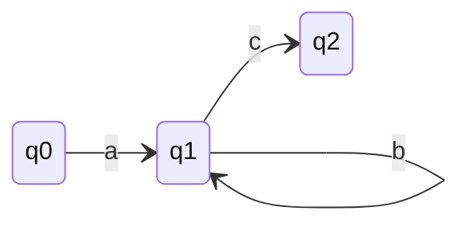
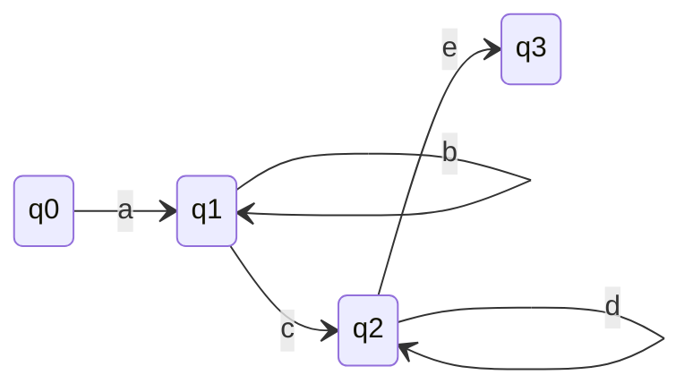
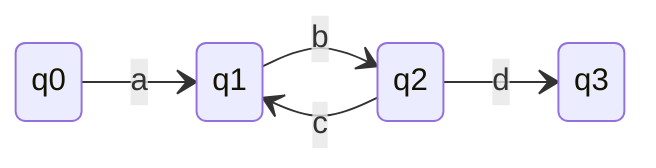
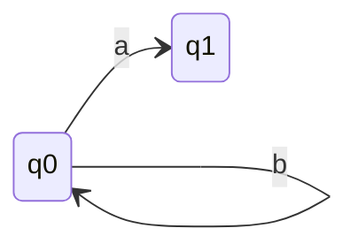
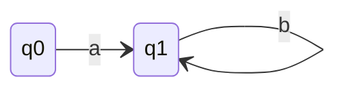
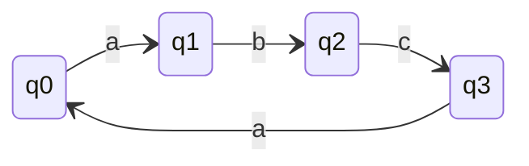
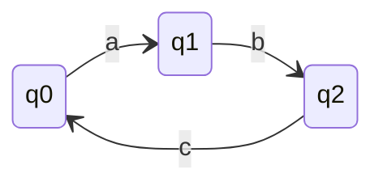
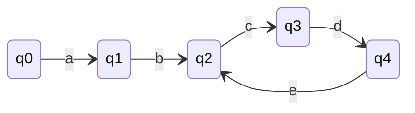

## How to proove Language is not regular with pumping Lemma?
- Assume L is regular.
- Hence there exists a FA of 'n' states which accepts L.
- Assume a string w $\in$ L and $|w| \geq n$.
- Hence in acceptance path of w there exists a loop i.e. one state is repeated [Piegon Hole Principle]
- Divide w into 3 parts x, y, z
  - x = substring of w before start of 1st loop
  - y = substring of w in 1st loop
  - z = substring of w after 1st loop
- Since w $\in$ L, then w' $\in$ L where w' = $xy^{i}z | i \geq 0$.
- Find w' which is $\notin$ L. Hence L is not regular.

## Q1

- Let w = abc ✅
  - x = a
  - y = b
  - z = c
- Let w = abbbc ✅
  - x = a
  - y = b
  - z = bbc
- Let w = ac ❌
  - w $\in$ L
  - |w| $\leq$ n
- Let w = acb ❌
  - |w| $\geq$ n
  - w $\notin$ L

## Q2

- Let w = abcde ✅
  - x = a
  - y = b
  - z = cde
- Let w = acde ✅
  - x = ac
  - y = d
  - z = e

## Q3

- Let w = abcbd ✅
  - x = a
  - y = bc
  - z = bd
- Let w = abcbcbcbd ✅
  - x = a
  - y = bc
  - z = bcbcbd

## Q4. When we are dividing w in 3 parts, x can be null or not?
- Yes, x can be null.

- Let w = bba ✅
  - x = ε
  - y = b
  - z = ba

## Q5. When we are dividing w in 3 parts, z can be null or not?
- Yes, z can be null.

- Let w = ab ✅
  - x = a
  - y = b
  - z = ε

## Q6. When we are dividing w in 3 parts, x & z can be null or not?
- Yes, x & z can be null.

- Let w = abca ✅
  - x = ε
  - y = abca
  - z = ε

## Q7. When we are dividing w in 3 parts, y can be null or not?
- No, y can't be null.
- If y is null then there exists no loop.
- Then |w| will not be $\geq$ n.

## Q8. What is the minimum and maximum length of y?
- Minimum length of y is 1.
- Maximum length of y is n.

## Q9. If |w| $\gt$ n where n is number of states in FA then
1. x will not be null
2. y will be $\gt$ n
3. z will not be null
4. Both 1 & 3
### Ans: 3

### q0 is initial and final
- Let w = abcabc
  - x = ε
  - y = abc
  - z = abc

## Q10. Range of |x| can be
- 0 $\leq$ |x| $\leq$ n-1

## Q11. Range of |xy| can be
- 1 $\leq$ |xy| $\leq$ n
- It cannot be greater than n because if |y| = n then x will be zero. If |y| = n-1 then x will be 1. (Common Sense 🧠)
- It cannot be less than 1 because y cannot be null.  
**Example**

- Let w = abcdecde ✅
  - x = ab
  - y = cde
  - z = cde

## Q12. Range of |z| can be for string of length w, where w $\geq$ n
- 0 $\leq$ |z| $\leq$ w-1
