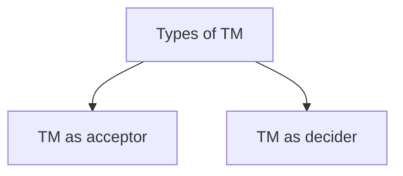
# Construction of Turing Machine

## L = {$a^{3n}|n\geq 0$}

### State Transision Diagram

- The moves here are represented as `read,write,moveDirection` where `moveDirection` can be `L` or `R` and `read` is what we read from the tape and `write` is what the read symbol is replaced with.
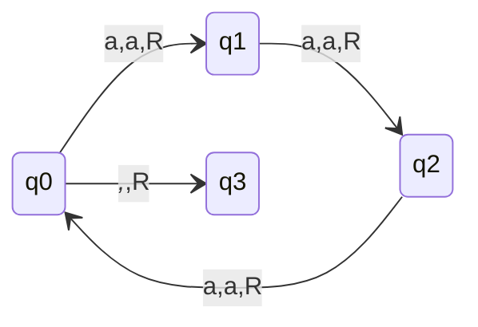
### q3 is the final state and _,_,R means that we are reading a blank symbol and replacing it with a blank symbol and moving right.

## Note:-
> No Transitions on final state.  
> If transition is on final state then it is ignored.  
> If TM enters any one of the final state then string will be accepted blindly.

## L = {$a^{3n}|n \geq 1$}
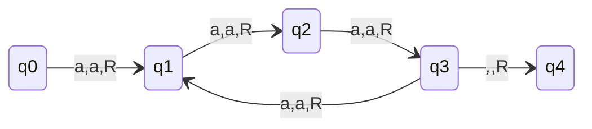
### q4 is the final state

## L = {$a^{3n+1}|n\geq 0$}
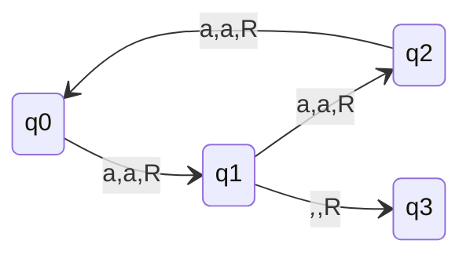
### q3 is the final state

> Dead Configuration can occur in Non-final states only.

## L = {$(a+b)^{*}$}
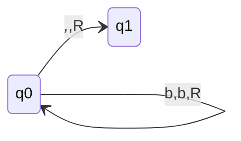
### also this is correct

## Note:- 
> Changing a to b and b to a won't affect as we won't traverse back in the string.  
> If a to 0 and b to 1 then Language accepted will be (a+b)*, as said earlier it won't affect the language.

## L = a(a+b)*
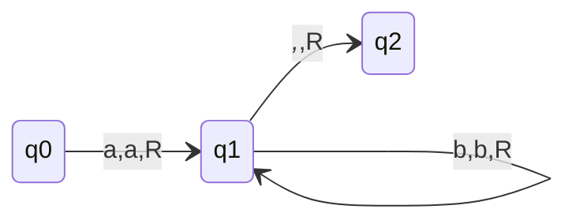
### q2 is the final state
- Also this is correct
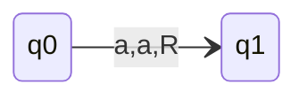
### q1 is the final state
- This is accepted as we discussed in [Notes](#note) that once we enter final state string is accepted blindly.

## Note:-
> In cases where we haven't read the blank symbol and reached the final state then after the string read we can add behind it(concatenate) $\Sigma^{*}$ to the string and it will still be accepted.

## Write Regular Expression for below State Transition Diagram
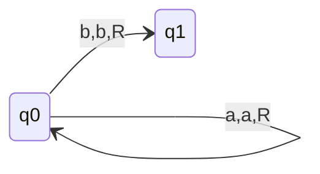
### q1 is the final state
- Here we can read any number of a's at qo and then anyone b is read we reach final state.
- Again as discussed [here](#note-2) once we reach final state without reading blank symbol we can add $\Sigma^{*}$ to the string and it will still be accepted.
- So, Answer is:- *a\*b(a+b)\**

## Write Regular Expression for below State Transition Diagram
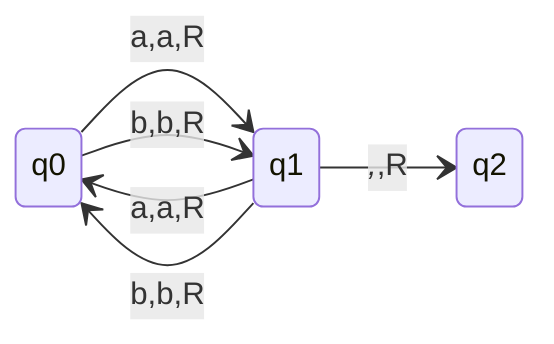
### q2 is the final state
- Odd number of character in the string

## Note:-
> If R/W head is allowed to move only in one direction then TM is equivalent to FA i.e. now this modified TM will accept only Regular Languages.  
> So in GATE if TM came & L(M) is asked to find then simply see if only one direction movement then L(M) is Regular Language but vice-versa is not true.

## State Transition Diagram
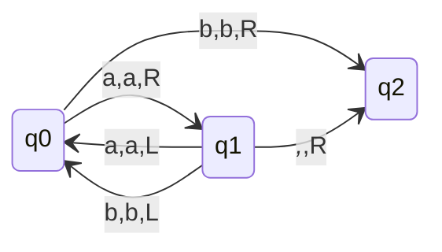
### q2 is the final state
- The machine will go to final state only in case of string is a or b, in other cases it will go under infinite loop.
### Summary
- L(M) = {a,b} $\rightarrow$ (a+b)
- Halting with input $\rightarrow$ {$\epsilon$,a,b}
- Non-halting with input $\rightarrow$ $(a+b)(a+b)(a+b)^{*}$
- Halt & Reject $\rightarrow$ $\epsilon$
- $L(M) \subseteq L(Halt)$

## State Transition Diagram
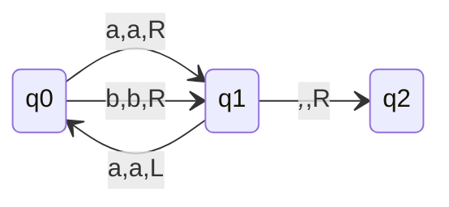
### q2 is the final state
### Summary
- Halt $\rightarrow$ $\epsilon$+a+b+(a+b)b(a+b)*
- Hang $\rightarrow$ (a+b)a(a+b)*
- L(M) $\rightarrow$ (a+b)
- Halt & Reject $\rightarrow$ $\epsilon$+(a+b)b(a+b)*