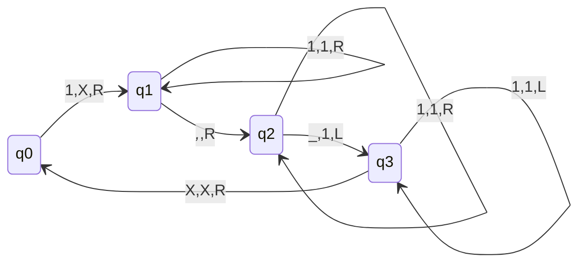
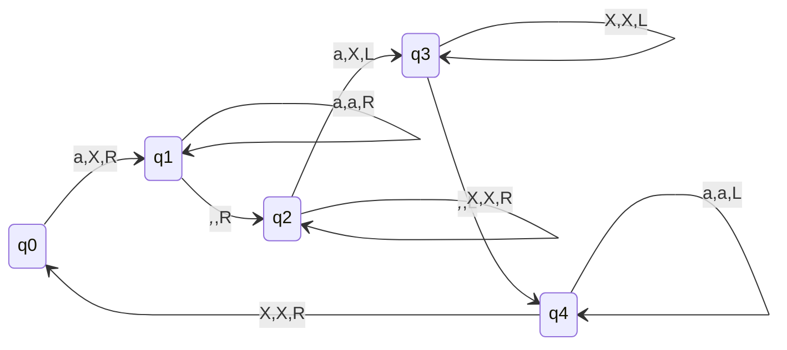

## Turing Machine to copy unary numbers (Copy Machine)

- Problem Statement: Like there are 4 one's on the tape and you need to copy those 4 one's on the tape after one blank space.
- Intuition:
  - read 1 and replace with X, go behind and after blank write 1
  - Now traverse Left until you find X
  - Shift right and read 1 follow step 1 and 2
  - If after X blank is encountered then we are done

## Turning Machine to compare two numbers (Compare Machine)

- Problem:
  - Two blank seperated strings are written on tape.
  - We need to compare and write if fist is bigger then at last write G, if second is bigger then write L and if both are equal then write E.
- Intuition:
  - Read a and replace with x, go up to balnk and then change state
  - now cut the a from second string and traverse back
  - continue this process

## Turing Machine can perform
- Base Conversion
- Any Base
  - Addition
  - Subtraction
  - Multiplication
  - Power
  - Division