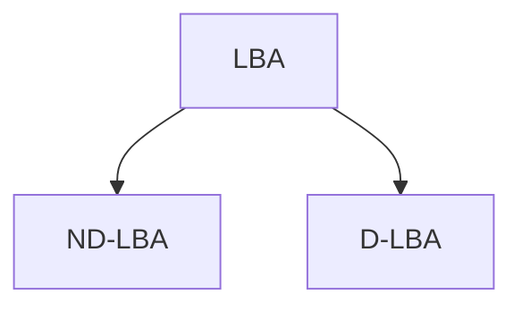

# Linear Bounded Automata

## Definition

If we Bounfd the tape length is infinite but use is bounded to a linear function of input size then it is called Linear Bounded Automata.  
Length Usage restriction is controlled by end markers.

```text
LBA = (Q, Σ, δ, q0, f, Γ, #, _)
Q = set of states
Σ = input alphabet
δ = transition function
q0 = initial state
f = final state
Γ = tape alphabet
# = left end marker
_ = right end marker
```

## Types of LBA


- Non-Deterministic LBA accepts the CSL.