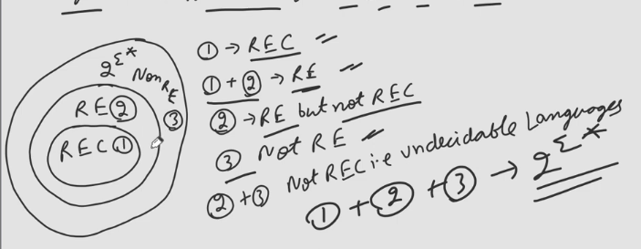

## Recursive Enumerable Language
A language is called RE iff it is accepted by a Turing Machine.  

Accept means we care about member only i.e. for members TM will halt and say yes but for non-members it may halt and say no or it may not halt at all.  

Hence RE is also known as Turing Recognizable Language. $\because$ TM is mainly concerned with recognizing members of L only.  

**Other Names:** Turing Recognizable Languages, Formal Languages, semi decidable languages, Undecidable Languages.

## Representation of any language
1. Listing Method
2. Set Builder Method
3. Statement Method
4. Grammar Method
5. Regular Expression Method
6. Machine Method

- Informal Methods
  - Listing Method
    - Listing all the members of L
    - L = {0, 1, 00, 01, 10, 11, 000, 001, 010, 011, 100, 101, 110, 111, ...}
    - Not possible for infinite languages
  - Set Builder Method
    - L = {x | x is a string of 0's and 1's}
  - Statement Method
    - All the strings of 0's and 1's
- Formal Methods
    - Grammar Method
      - S -> 0S | 1S | 0 | 1 | $\epsilon$
    - Regular Expression Method (Only for Regular Languages)
      - (0 + 1)*
    - Machine Method
      - Turing Machine

## Recursive Language
A language is called Recursive iff it is accepted by a Halting Turing Machine. **OR** A language is called Recursive iff it is accepted by a Turing Machine and TM halts $\forall$ w $\in$ $\Sigma^*$.  

```text
- Indentify the Language for below Statement
- L is a language iff it is accepted by a Turing Machine and TM halts for all w in L.
- RE (don't write REC and here given is w in L not w in Sigma star)
```

**Other Names:** Decidable Languages, Turing Decidable Languages  

## Venn Diagram


## Q. If for L HTM exists
- L is Recursive (Region 1)

## Q. If for L TM exists
- L is RE (Region 1 & 2)

## Q. If for L no TM exists
- L is not RE (Region 3)

## If for L no HTM exists
- L is not Recursive (Region 2 & 3)(Undecidable)

## If for L TM exists but is not HTM
- L is RE but not Recursive (Region 2)

> Always Say RE and REC together
>> RE $\rightarrow$ REC + RE
>> Complement of RE but not REC $\rightarrow$ Non RE