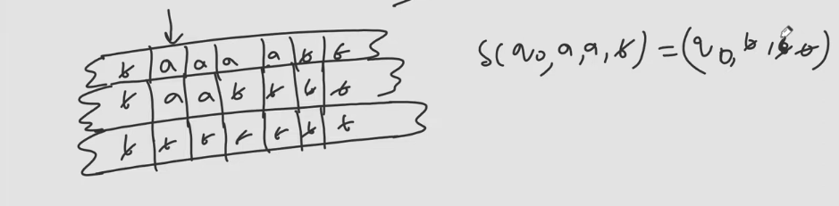

1. Storage in finite control
   - In FSCM, the finite control has a storage component that can store a finite number of symbols besides the current state.
   - Won't increase the power then Standard Turing Machine
   - No. of states might get decreased.
2. Multitrack Turing Machine
   - Here there other tracks below the input tape.
   - At each step, the head can move in all the tracks, and read symbols from all the tracks.
   - 
   - Same Power
3. One-Way $\infty$ tape/ Semi-infinite tape
   - Just like the standard TM, but the tape is one way infinite.
   - Same Power
4. Multi Tape
   - More than one Single tapes.
   - Same Power.
   - One thing is if Multitape TM takes $O(n)$ time, then Single tape TM takes $O(n^2)$ time.
5. Turing Machine with Stay Option
   - As we were supposed to give direction L or R, here we have one more option, stay at the same place.
   - Same Power
6. Off-line Turing Machine
   - Here the input is given to the TM in the form of a list of symbols.
   - This tape is read-only.
   - If K-tape turing machine is there we will have one extra tape which is made read-only.
   - Same Power
7. Jumping Turing Machine
   - Here the head can jump to any position on the tape.
   - Same Power
8. Non-erasing Turing Machine
   - Here the head can replace given symbol with another symbol but not with blank.
   - Same Power
9. Always write Turing Machine
   - Here the head need to replace the symbol with another symbol whenever it reads a symbol.
   - Same Power
10. multidimensional Turing Machine
    - Many tracks but read only one cell and direction from there can left,right,up or down.
    - Same Power